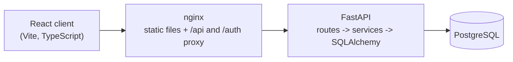

# TaskFlow

A small project and task management application. A user signs up, groups work
into projects, and moves each task through `TODO`, `IN_PROGRESS` and `DONE`.

The repository holds a React client and a FastAPI service backed by PostgreSQL.

## Features

- Register, sign in and sign out with JWT authentication
- Profile screen showing the signed-in account
- Create, view, update and delete projects
- Create, update, delete tasks and change their status
- Search tasks by title or description and filter them by status
- Per-project statistics and a dashboard summary across all projects
- Every project and task is scoped to the user who owns it

## Architecture



The client keeps its JWT in `localStorage` and attaches it to every request
through an axios interceptor. When the API rejects a token the interceptor
clears it and the app returns to the sign-in screen with a "session expired"
message.

Request handling on the server is deliberately thin: route handlers validate
input with Pydantic and delegate to a service module, which owns the database
work and the ownership rules. A project or task belonging to another user
answers `404` rather than `403`, so the API does not confirm that an id exists.

Data model:

```text
User 1 --- * Project 1 --- * Task
```

Deleting a user deletes their projects, and deleting a project deletes its
tasks, through `ON DELETE CASCADE`.

## Tech Stack

| Layer    | Choice                                                     |
| -------- | ---------------------------------------------------------- |
| Client   | React 18, TypeScript, React Router, axios, plain CSS        |
| Build    | Vite, ESLint, Vitest with Testing Library                   |
| API      | FastAPI, Pydantic v2, SQLAlchemy 2, Alembic, PyJWT, bcrypt  |
| Database | PostgreSQL 16                                               |
| Tooling  | Docker Compose, GitHub Actions, ruff, pytest                |

## Project Structure

```text
.
├── src/                    React client
│   ├── components/         Reusable UI: fields, buttons, modal, state views
│   ├── hooks/              Auth context, data loading, debounce
│   ├── pages/              One component per screen
│   ├── routes/             Route table and the authenticated-route guard
│   ├── services/           axios client and API calls
│   ├── types/              Shared request and response types
│   └── utils/              Validation, error messages, formatting
├── backend/
│   ├── alembic/            Migration environment and versions
│   └── app/
│       ├── api/            Dependencies and route handlers
│       ├── core/           Settings, password hashing, JWT helpers
│       ├── db/             Declarative base and engine/session setup
│       ├── models/         SQLAlchemy models
│       ├── schemas/        Pydantic request and response models
│       ├── services/       Business logic and ownership checks
│       └── tests/          pytest suite
├── docker-compose.yml      frontend, backend and postgres
├── Dockerfile              Client build served by nginx
└── nginx.conf              SPA fallback and API proxy
```

## Local Development

Requires Node 20+, Python 3.11+ and a PostgreSQL instance.

**API**

```bash
cd backend
python -m venv .venv && source .venv/bin/activate
pip install -r requirements-dev.txt
cp .env.example .env          # then set JWT_SECRET
alembic upgrade head
uvicorn app.main:app --reload
```

The API listens on http://localhost:8000 and documents itself at `/docs`.

**Client**

```bash
npm install
npm run dev
```

The client runs on http://localhost:3000. In development Vite proxies `/api`
and `/auth` to the API, so no CORS configuration is needed.

Useful scripts: `npm run lint`, `npm run typecheck`, `npm test`, `npm run build`.

## Environment Variables

The API reads configuration from the environment or `backend/.env`
(see `backend/.env.example`). Nothing secret is committed.

| Variable                      | Default                       | Purpose                                        |
| ----------------------------- | ----------------------------- | ---------------------------------------------- |
| `DATABASE_URL`                | local Postgres URL            | SQLAlchemy connection string                   |
| `JWT_SECRET`                  | _required_                    | Signing key; must be at least 32 characters    |
| `ACCESS_TOKEN_EXPIRE_MINUTES` | `60`                          | Token lifetime                                 |
| `CORS_ORIGINS`                | `http://localhost:3000`       | Comma separated list of allowed browser origins|
| `BCRYPT_ROUNDS`               | `12`                          | Password hashing work factor                   |

The client accepts an optional `VITE_API_URL` when the API is not served from
the same origin. The root `.env.example` covers the variables Docker Compose
passes through.

## Database Setup

Schema changes are made with Alembic; the database is never edited by hand.

```bash
cd backend
alembic upgrade head                      # apply migrations
alembic revision --autogenerate -m "..."  # create one after changing a model
alembic check                             # models and migrations agree
```

The containers run `alembic upgrade head` on start, so a fresh volume gets its
schema automatically.

## API Overview

All `/api` routes and `/auth/me` require an `Authorization: Bearer <token>`
header and only return data owned by the signed-in user.

| Method   | Path                          | Purpose                             |
| -------- | ----------------------------- | ----------------------------------- |
| `POST`   | `/auth/register`              | Create an account                   |
| `POST`   | `/auth/login`                 | Exchange credentials for a token    |
| `GET`    | `/auth/me`                    | The signed-in user                  |
| `GET`    | `/api/projects`               | Projects with their task counts     |
| `POST`   | `/api/projects`               | Create a project                    |
| `GET`    | `/api/projects/{id}`          | A single project                    |
| `PUT`    | `/api/projects/{id}`          | Update a project                    |
| `DELETE` | `/api/projects/{id}`          | Delete a project and its tasks      |
| `GET`    | `/api/projects/{id}/stats`    | Task counts and completion percent  |
| `GET`    | `/api/projects/{id}/tasks`    | Tasks, with `status` and `search`   |
| `POST`   | `/api/projects/{id}/tasks`    | Create a task                       |
| `PUT`    | `/api/tasks/{id}`             | Update a task, including its status |
| `DELETE` | `/api/tasks/{id}`             | Delete a task                       |
| `GET`    | `/health`                     | Liveness check                      |

## Testing

```bash
cd backend && pytest     # API tests: auth, projects, tasks, ownership
npm test                 # client behaviour tests
```

The API tests run against an in-memory SQLite database with foreign keys
enabled, so they need no running services. They cover registration and login,
token validation including expiry, project and task CRUD, filtering, and the
checks that keep one user out of another user's data.

The client tests cover sign-in validation and failure messages, the redirect
for unauthenticated visitors, and the project screen's loading, empty, error
and create paths.

## Docker

```bash
docker compose up --build
```

That starts PostgreSQL with a named volume, applies migrations, serves the API
on http://localhost:8000 and the client on http://localhost:3000, where nginx
proxies `/api` and `/auth` to the API.

Compose falls back to development values so the stack starts with one command.
Copy `.env.example` to `.env` and set a real `JWT_SECRET` for anything beyond
local use.

## CI

`.github/workflows/ci.yml` runs on pushes to `main` and on pull requests:

- **Frontend** — `npm ci`, ESLint, `tsc --noEmit`, Vitest, production build
- **Backend** — ruff lint and format check, pytest, and `alembic upgrade head`
  plus `alembic check` against a PostgreSQL service so migrations cannot drift
  from the models

The pipeline fails if any of those steps fail.
